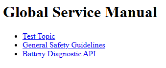

## DITA-OT Plugins
This project uses the standard DITA-OT plugins included in `dita-ot/plugins/` (e.g., `org.dita.html5`, `org.dita.pdf2`).
To list installed plugins, run:
```bash
./dita-ot/bin/dita --install
```
To add plugins, see the [DITA-OT documentation](https://www.dita-ot.org/plugins/).

## DITA Validation & Linting
For best results, validate your DITA content before building:
- Use the built-in DITA-OT validator:
   ```bash
   ./dita-ot/bin/dita --validate --input=maps/service_manual.ditamap
   ```
- For advanced linting, consider [dita-ot-lint](https://github.com/jelovirt/dita-ot-lint) or [Oxygen XML Editor](https://www.oxygenxml.com/).

# Global Technical Documentation Framework


A DITA-based project demonstrating structured authoring, localization, and automated publishing.

## Features
- Topic-based authoring (concepts, tasks, references)
- Localization-ready content
- Content reuse via DITA conrefs and keys
- GitHub Actions automation

## Setup
1. Clone this repo:
   ```bash
   git clone https://github.com/johnbeatty575/global-tech-docs.git
   cd global-tech-docs
   ```
2. Install [Java 17+](https://adoptium.net/).
3. Build documentation (HTML5):
   ```bash
   ./dita-ot/bin/dita --input=maps/service_manual.ditamap --format=html5 --output=out/html5
   ```
   Or build PDF:
   ```bash
   ./dita-ot/bin/dita --input=maps/service_manual.ditamap --format=pdf --output=out/pdf
   ```
   
   **Troubleshooting:**
   - Ensure `JAVA_HOME` is set and `java -version` returns Java 17+.
   - On Unix, run `chmod +x ./dita-ot/bin/dita` if you get a permission error.
   - For plugin errors, run `./dita-ot/bin/dita --install` to check plugin status.
   - For Windows, use Git Bash or WSL for best results.

4. **CI/CD:**
   - Automated builds run on push via GitHub Actions ([see workflow](.github/workflows/dita-build.yml)).

## Project Demo
- **HTML Output**: [View Sample](https://johnbeatty575.github.io/global-tech-docs/) (hosted via GitHub Pages)
- **PDF Output**: [Download Latest Build](./out/pdf/service_manual.pdf)


<!-- Project Overview Diagram Placeholder -->
<!--

-->



## Skills Demonstrated
- **XML/DITA**: Topic-based authoring, maps, profiling, reuse.
- **Localization**: Region-aware content via DITA profiling.
- **DevOps**: CI/CD with GitHub Actions, automated publishing.
- **Technical Depth**: API documentation, safety-critical content.

## Setup (For Contributors)
Follow the steps above. For custom maps or outputs, adjust the `--input` and `--format` arguments as needed.

## Practical Guides (New)
This repository now includes a set of practical, reusable guides intended for real-world usage by technical writers and engineers. They are located under `topics/guides/` and are included in the default `maps/service_manual.ditamap`.

Included guides:

- `topics/guides/technical_writer_guide.dita` — practical conventions and a documentation-as-code workflow.
- `topics/guides/onboarding_checklist.dita` — a simple onboarding checklist for new contributors.
- `topics/guides/api_documentation_template.dita` — a template for API endpoint documentation.
- `topics/guides/code_review_guidelines.dita` — suggested code-review practices for docs that ship with code.

How to use:

1. Copy a guide from `topics/guides/` to start new project-specific documentation.
2. Replace example content with concrete project details (endpoints, commands, standards).
3. Run the DITA build locally and attach HTML/PDF artifacts to PRs for reviewers.

This path is intended to be the primary user-facing documentation; self-referential topics are retained under `topics/` as learning artifacts.

## Publishing
We now automatically publish the HTML output to GitHub Pages on pushes to `main`/`master` via CI. The workflow builds `out/html5` and deploys the result to the repository's Pages site using `peaceiris/actions-gh-pages`.

If you'd rather preview locally, build HTML and open `out/html5/index.html` in a browser.

## More documentation
For a short architecture overview and developer instructions see:

- `docs/ARCHITECTURE.md` — high-level architecture and where to find things.
- `docs/DEVELOPER_GUIDE.md` — step-by-step local setup, build, accessibility and generator commands.
